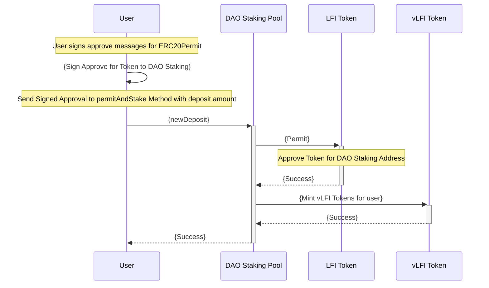

### One Step DAO Staking Pool Deposit
One method call to DAO Staking Poool to Approve + Deposit Utilising ERC20 permit.

```mermaid
sequenceDiagram
    participant A as User
    participant B as DAO Staking Pool
    participant C as LFI Token
    participant D as vLFI Token
    Note over A: User signs approve messages for ERC20Permit
    A->>A: {Sign Approve for Token to DAO Staking}
    Note over A: Send Signed Approval to permitAndStake Method with deposit amount
    A->>+B: {newDeposit}
    B->>+C: {Permit}
    Note over C: Approve Token for DAO Staking Address
    C-->>-B: {Success}
    B->>+D: {Mint vLFI Tokens for user}
    D-->>-B: {Success}
    B-->>-A: {Success}
```
