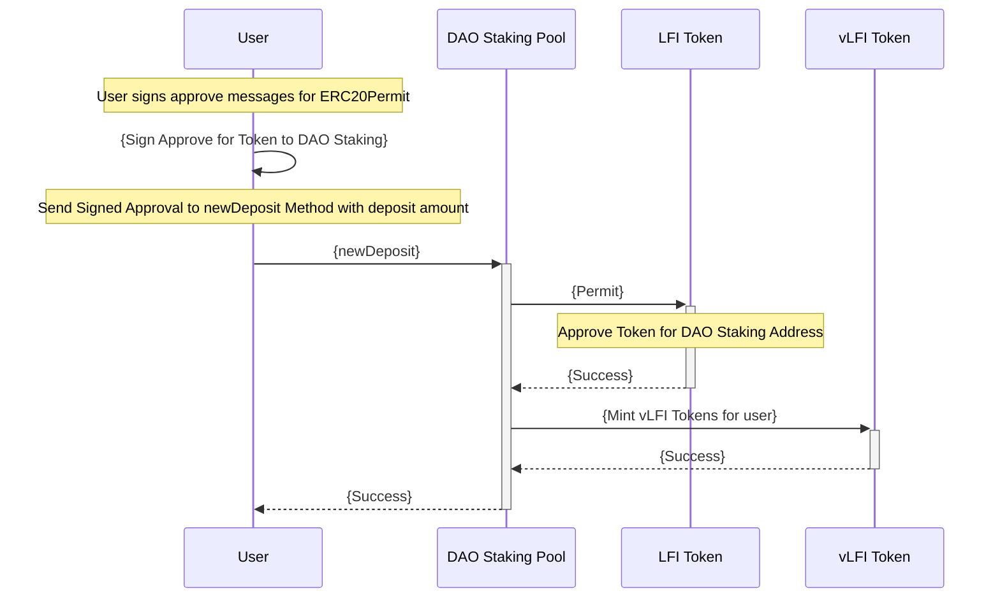
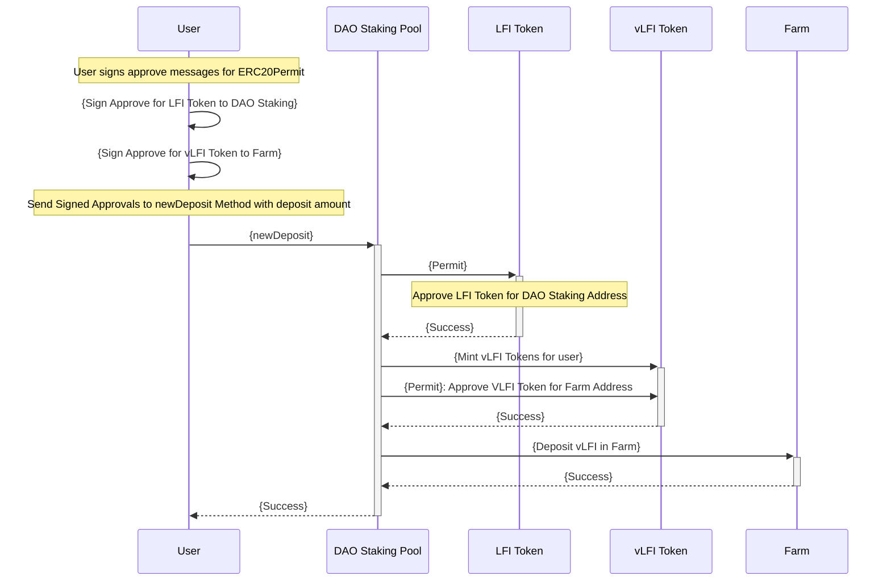

### One Step DAO Staking Pool Deposit
One method call to DAO Staking Poool to Approve + Deposit

### One Step DAI Staking Rewards
One method call to DAO Staking Pool for Deposit to Staking Pool and LFI Farm

