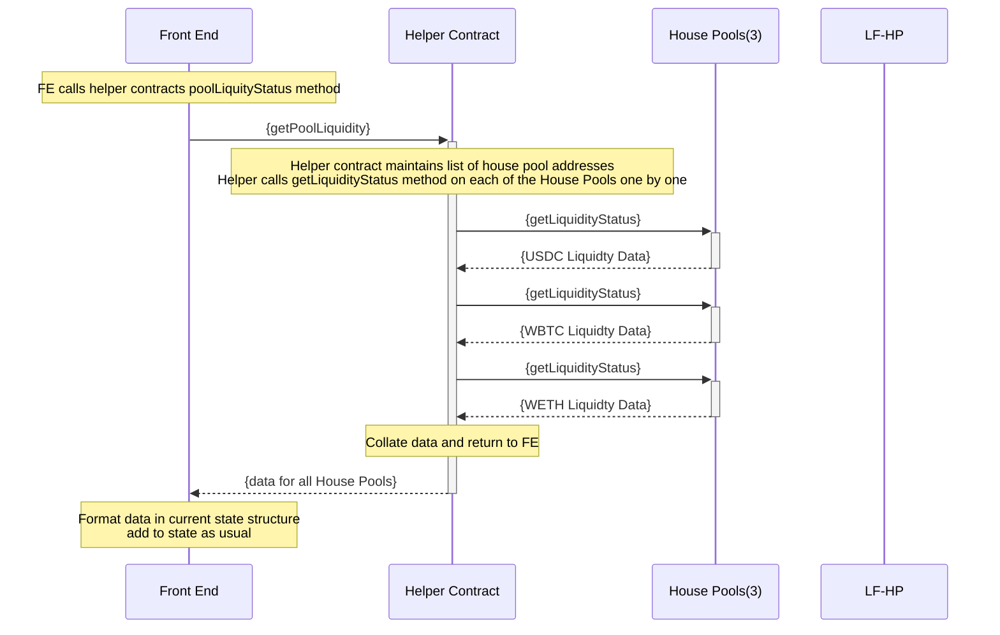

### Helper Contract for Front End

Front end currently calls a number of contracts and reads information in multiple calls to the blockchain.
This has time delay as well as cost implications due to multiple calls going through infura.
We can create a contract that does all the read operation calls to house pools and collate this data and send in a singe call.

#### 1. POC

As a first step lets try and get liquidity for all pools in one call
In the front end we can remove mulitple calls for `getLiquidityStatus` and replace it with one call to to `HelperContract.getLiquidityStatus()`

