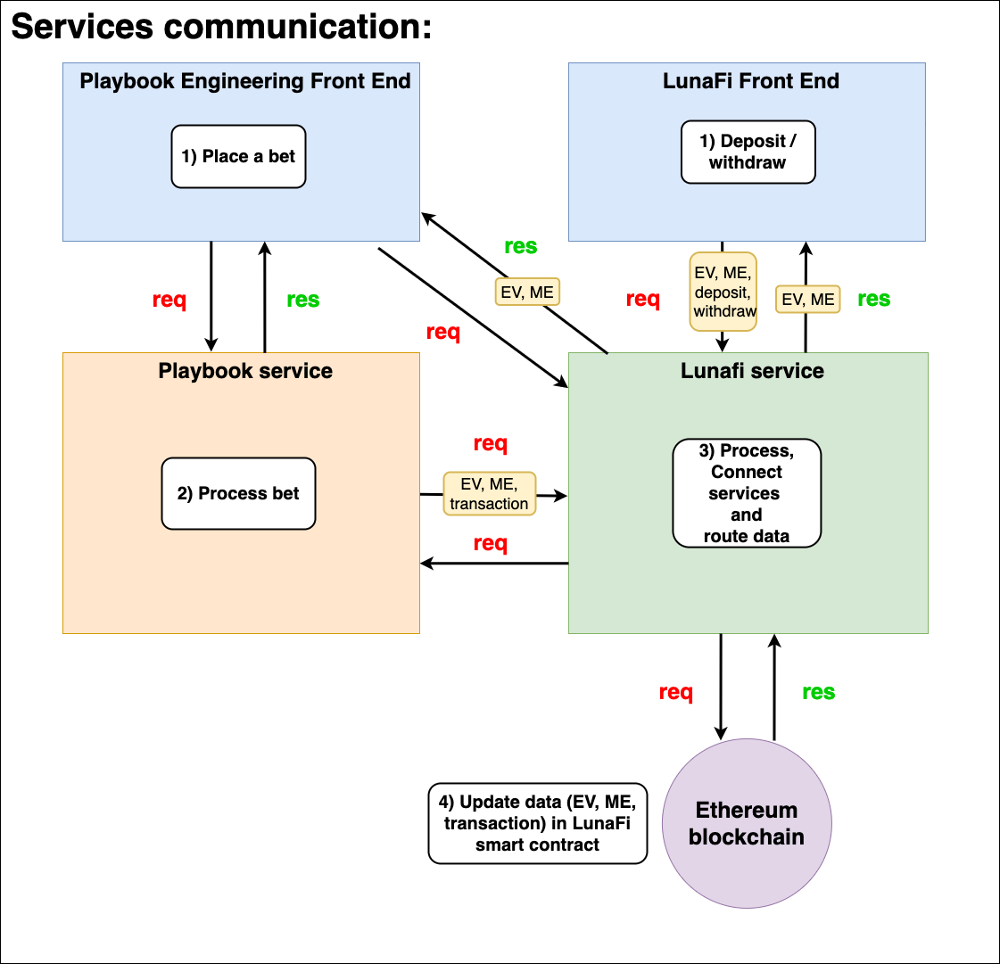
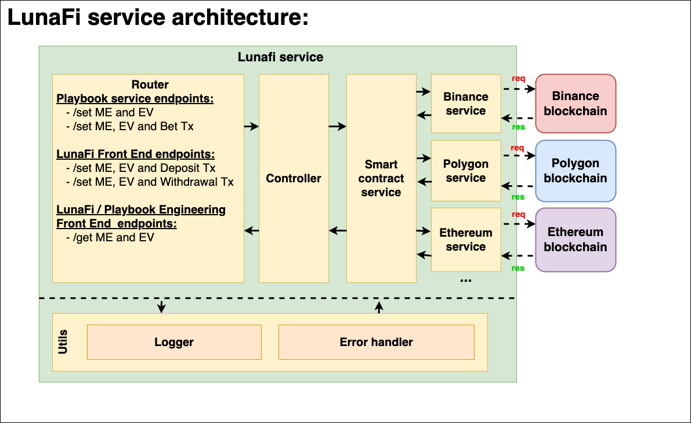
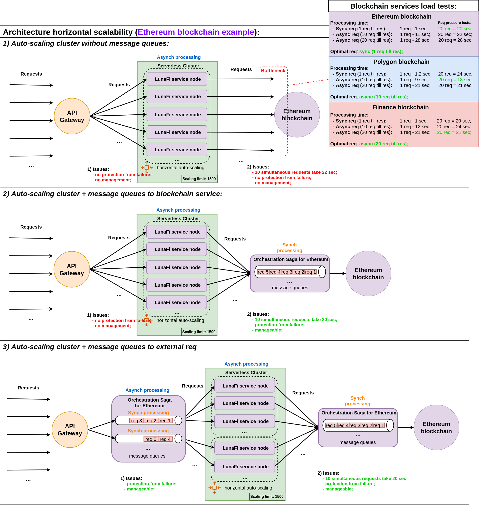
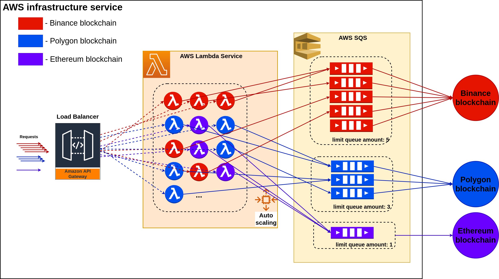

# Initial LunaFi back-end design:

### <a href="https://app.diagrams.net/?mode=github#HLuna-Fi%2Flunafi-be%2Finitial-design%2Fdocs%2Fimages%2Fservices-communication.png" target="_blank">Edit</a>

### <a href="https://app.diagrams.net/?mode=github#HLuna-Fi%2Flunafi-be%2Finitial-design%2Fdocs%2Fimages%2FlunaFi-service-architecture.png" target="_blank">Edit</a>

### <a href="https://app.diagrams.net/?mode=github#HLuna-Fi%2Flunafi-be%2Finitial-design%2Fdocs%2Fimages%2Farchitecture-horizontal-scalability.png" target="_blank">Edit</a>

### <a href="https://app.diagrams.net/?mode=github#HLuna-Fi%2Flunafi-be%2Finitial-design%2Fdocs%2Fimages%2Faws-infrastructure-services.drawio.png" target="_blank">Edit</a>