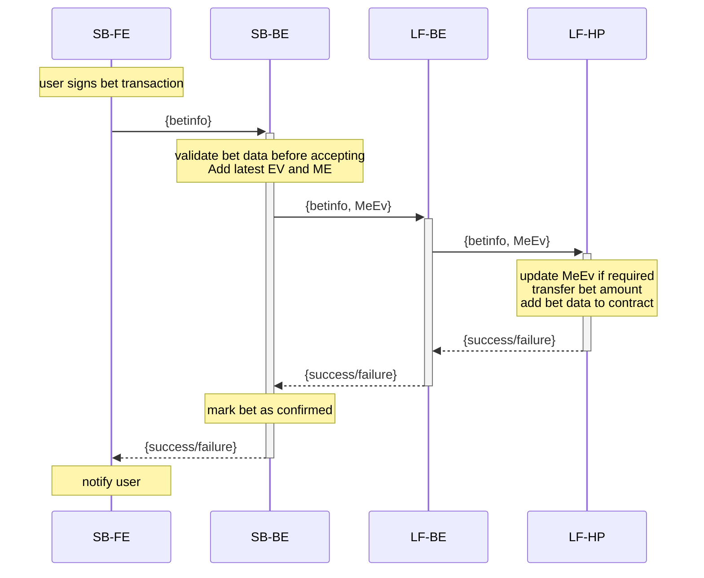

### Placing a bet

Components, parameters and descriptions

| Symbol  | Description                                                  |
| :------ | ------------------------------------------------------------ |
| SB-FE   | Sports Book Front-End                                        |
| SB-BE   | Sports Book Back-End                                         |
| LF-BE   | LunaFi Back-End                                              |
| LF-HP   | LunaFi House Pool Contract                                   |
| betinfo | Signed transaction with bet data and token transacton. Data to include: { betID, marketID, amount, outcome, stakes } |
| MeEv    | Maximum Exposure and Expected Value of outstanding bets. Signed by authorised Oracle wallet private key |
