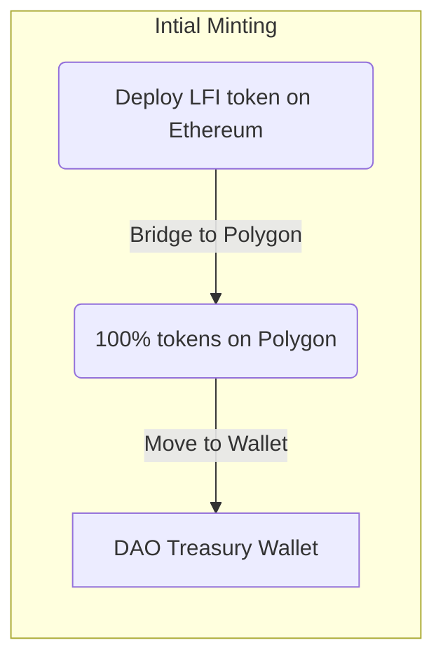
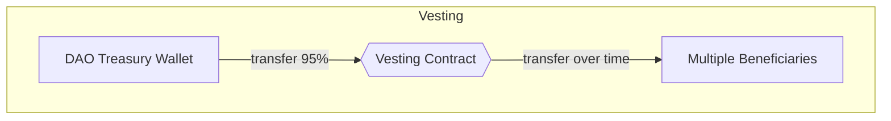
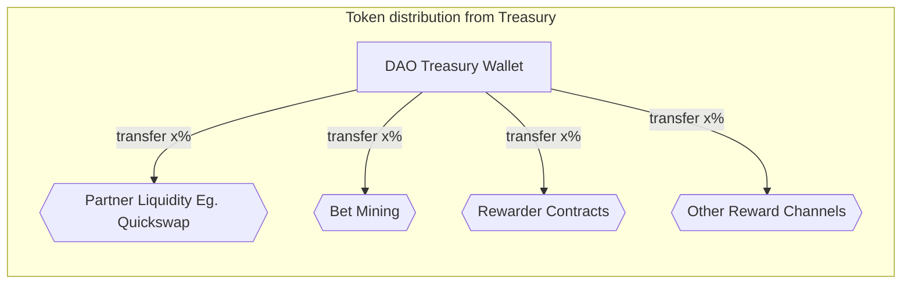

## Token Flow

#### Step 1: Genesis - Initial minting and bridging

- LFI token contract will be deployed to Ethereum mainnet with total supply minted on deployment.
- All minted tokens will then be bridged to Polygon mainnet using Polygon provided bridge at: https://wallet.polygon.technology/bridge
- All minted tokens will then be moved to LunaFi Treasury Wallet, which is a Gnosis Safe with 3 of 5 MultiSig Wallet
- All access control roles of Token contract will be assigned to Time Lock controlled governer with LunaFi Treasury Wallet as executer.
- The default admin role will be renounced.

#### Step 2: Vesting

- Tokens that are to be vested as per the vesting schedule will be moved to a vesting contract on Polygon.
- Vesting contract will release vested tokens to designated wallets as per the time locked schedule.
- Vested tokens will be transferred from the contract to designated wallets every fortnight.

#### Step 3: Distribution from Treasury Wallet

The Treasury wallet will distribute tokens to farm rewards and other channels for incentives, partner rewards and partner liquidity like Quickswap liquidity pools.

